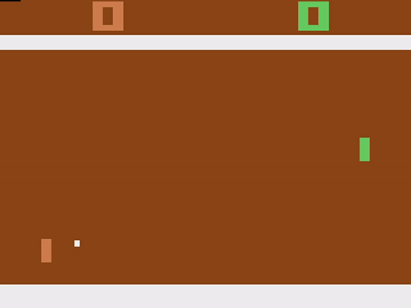

# RL Assignments

<p align="center">
  <!--  -->
  
  
  
</p>

Template code for reinforcement learning assignments, for cheetah, pong, and breakout, pointmass, cartpole, and more tasks.

## Getting Started

Reuse your hw1/ environment:

Install requirements:

```
conda activate HW1_ENV_NAME
pip install -r requirements.txt
```

and it should be good to go.


## Training

To train a policy, run the following command:

```
python run.py --env_config data/envs/dm_cheetah.yaml --agent_config scripts/dm_cheetah_cem_agent.yaml --mode train --log_file output/log.txt --out_model_file output/model.pt --visualize
```

- `--env_config` specifies the configuration file for the environment.
- `--agent_config` specifies configuration file for the agent.
- `--visualize` enables visualization. Rendering should be disabled for faster training.
- `--log_file` specifies the output log file, which will keep track of statistics during training.
- `--out_model_file` specifies the output model file, which contains the model parameters.
- `--num_workers` specifies the number of worker processes used to parallelize training (you can use CPU to parallerize as well).

## Testing

To load a trained model, run the following command:

```
python run.py --env_config data/envs/dm_cheetah_env.yaml --agent_config scripts/dm_cheetah_cem_agent.yaml --mode test --model_file [path to model.pt] --visualize
```

- `--model_file` specifies the `.pt` file that contains parameters for the trained model.


## Visualizing Training Logs

During training, a tensorboard `events` file will be saved the same output directory as the log file. The log can be viewed with:

```
tensorboard --logdir=output/ --port=6006 --bind_all
```


The output log `.txt` file can also be plotted using the plotting script in `tools/plot_log/plot_log.py`.
